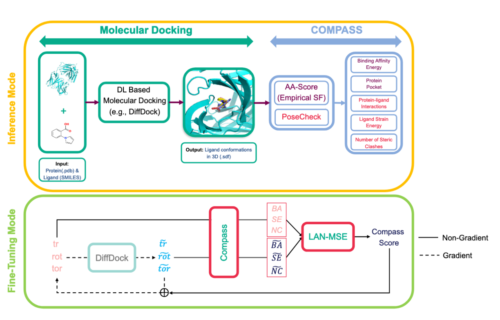

<!--# COMPASS-->

# Compass 🧭: A Comprehensive Tool for Accurate and Efficient Molecular Docking in Inference and Fine-Tuning

<p align="center">
    Navigating Future Drugs with Compass 🧭
</p>

<p align="center">
  <!--<a href="https://arxiv.org/abs/"></a>-->
  <a href="https://pytorch.org/"></a>
  <a href="https://pytorch-geometric.readthedocs.io/en/latest/"></a>
  <a href=https://github.com/BIMSBbioinfo/Compass/blob/main/LICENSE></a>
  <!--<a href="Give a link here" alt="license"></a>-->
</p>

<!--PUT THE ANIMATED GIF VERSION OF THE DRUGGEN MODEL (Figure 1)-->
<p float="center">
  
</p>


Official Implementation of *Compass: A Comprehensive Tool for Accurate and Efficient Molecular Docking in Inference and Fine-Tuning* paper.

Developed by Ahmet Sarıgün*, Vedran Franke, and Altuna Akalin, Compass is designed for accurate and efficient molecular docking in both inference and fine-tuning phases. This repository provides the necessary code and instructions to utilize the method effectively.

Should you have any questions or encounter issues, please feel free to open an issue on this repository or contact us directly at [Ahmet.Sariguen@mdc-berlin.de](mailto:Ahmet.Sariguen@mdc-berlin.de).


Check out our paper below for more details:

> [**Compass: A Comprehensive Tool for Accurate and Efficient Molecular Docking in Inference and Fine-Tuning**](https://arxiv.org/abs/),            
> [Ahmet Sarıgün](https://asarigun.github.io/), [Vedran Franke](https://de.linkedin.com/in/vedran-franke-1030ba24), [Altuna Akalin](https://al2na.co/)     
> *Arxiv, 2024*


## Usage  <a name="usage"></a>

### Setup Environment  <a name="environment"></a>

Set up your development environment using [Anaconda](https://docs.anaconda.com/anaconda/install/index.html). Start by cloning the repository:

```bash
git clone https://github.com/BIMSBbioinfo/Compass.git
```

Once you have cloned the repository, navigate to its root directory and execute the following commands to create and activate the `compass` environment:

```bash
conda env create --file environment.yml
conda activate compass
```

For additional details on managing conda environments, refer to the [conda documentation](https://conda.io/projects/conda/en/latest/commands/env/create.html).


### Docking with Compass 🧭 in Inference Mode <a name="inference"></a>

Our approach for inference aligns with the method used in [DiffDock](https://github.com/gcorso/DiffDock/blob/main/README.md#docking-prediction--). The same data formats are applicable here as well.

For protein inputs, you can use `.pdb` files or provide sequences that will be folded using ESMFold. For the ligands, inputs can be in the form of a SMILES string or files readable by RDKit, such as `.sdf` or `.mol2`.

To process a single complex, specify the protein using `--protein_path protein.pdb` or `--protein_sequence GIQSYCTPPYSVLQDPPQPVV`, and the ligand using `--ligand_description ligand.sdf` or `--ligand_description "COc(cc1)ccc1C#N"`.

If you want to do a redocking with recursion, you can use `--max_recursion_step`.

And you are ready to run inference for compass with single complex:

```bash
python -W ignore -m main_inference --config DiffDock/default_inference_args.yaml  --protein_path example/proteins/1a46_protein_processed.pdb  --ligand_description  "C1=CN=C(N1)CCNC(=O)CCCC(=O)NCCC2=NC=CN2"  --out_dir results/user_predictions_small --max_recursion_step 2
```

You will get Binding Affinity Energy, Strain Energy of Ligand, Number of Steric Clashes of Complex and Interaction Information of Complex. Also, you'll get the protein pocket in `.pdb` in `pockets/` where you save your results in `--out_dir` to better understand the region of docked molecule in protein pocket.

If you have multiple protein target files and multiple ligand files/SMILES you want to run, give protein files' direction with `--protein_dir` and indicate the range of them with `--protein_start` and `--protein_end`. Also if you have `.txt` file containing SMILES, you can give the direction with `--smiles_dir` and range them with `--smiles_start` and `--smiles_end`.


Now you can run a couple of proteins and ligands at the same inference run:

```bash
python -W ignore -m main_inference --config DiffDock/default_inference_args.yaml  --protein_dir example/proteins  --smiles_dir  example/smiles.txt  --out_dir results/user_predictions_small --max_recursion_step 1  --protein_start 0 --protein_end 2 --smiles_start 0 --smiles_end 2
```


## Datasets  <a name="datasets"></a>


Only the PDBBind dataset is utilized in this project. The data processing guidelines provided in [DiffDock](https://github.com/gcorso/DiffDock/blob/main/README.md#datasets--) and the steps for generating [ESM Embeddings](https://github.com/gcorso/DiffDock/blob/main/README.md#generate-the-esm2-embeddings-for-the-proteins) are also applicable here.


### Compass 🧭 in Fine-Tuning Mode <a name="finetuning"></a>

After generating ESM embeddings, run the Inference Mode once to download the pretrained DiffDock-L. Now, we're ready to finetune DiffDock with Compass:

```bash
python -W ignore -m finetune --config experiments/model_parameters.yml
```
## Citation

### License

This code is available for **non-commercial scientific research purposes** as will be defined in the [LICENSE file](LICENSE) which is **Attribution-NonCommercial-NoDerivatives 4.0 International**. By downloading and using this code you agree to the terms in the [LICENSE](LICENSE). Third-party datasets and software are subject to their respective licenses.

Components of the code of the [spyrmsd](spyrmsd) by Rocco Meli (MIT license), [DiffDock](DiffDock) by Gabriele Corso (MIT license), [AA-Score](AA_Score_Tool) by Xiaolin Pan (GNU General Public License v2.0) and [PoseCheck](posecheck) by Charlie Harris (MIT license) were integrated in the repo.

## Acknowledgements <a name="acknowledgements"></a>
We extend our deepest gratitude to the following teams for open-sourcing their valuable Repos:
* [DiffDock Team](https://github.com/gcorso/DiffDock) (version 2023 & 2024),
* [AA-score Team](https://github.com/Xundrug/AA-Score-Tool),
* [PoseCheck Team](https://github.com/cch1999/posecheck) 

